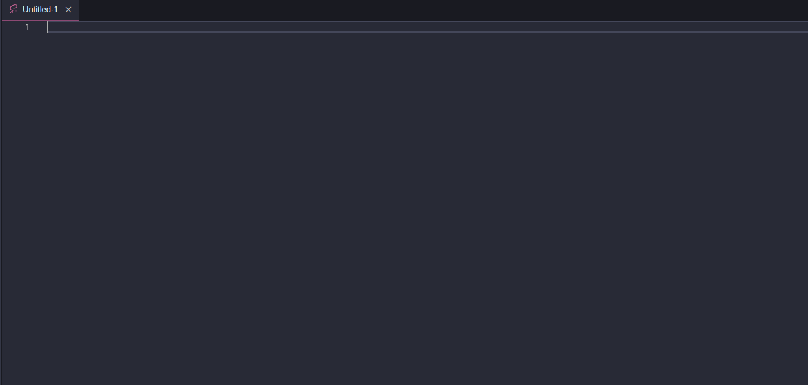

# Snippets Niten Tokens

Snippets for [Niten Tokens Design System](https://github.com/getninjas/niten-tokens/)

## Usage

Type part of a snippet, press `nt`, and the snippet unfolds.

## Snippets

Check the snippet list [here](./SNIPPETS-LIST.md)

## Known Issues

[GitHub Issues](https://github.com/getninjas/niten-vscode-snippets/issues)

## Release Notes

Users appreciate release notes as you update your extension.

### 0.2.0

- Fix line-height snippets

### 0.1.0

- Doc Improvements
- Fix line-height description

### 0.0.1

- Added snippets to use Niten Tokens

## License

[MIT](https://github.com/getninjas/niten-vscode-snippets/blob/master/LICENSE)
